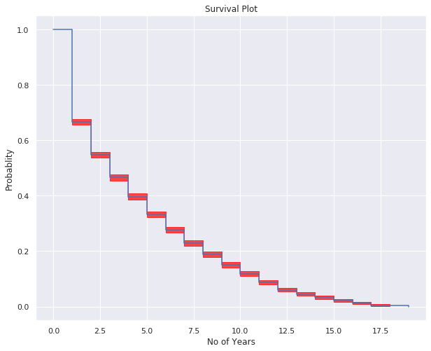

# Survival Analysis in International Rugby Union

A brief look into the lengths of international playing careers using survival analysis, specifically Kaplan Meier. These data were scraped from [ESPN Scrum](http://stats.espnscrum.com/statsguru/rugby/stats/index.html) and subsequently analysed acorss Tier 1 teams.

The graph illustrates the survival times across all teams.
  
 
